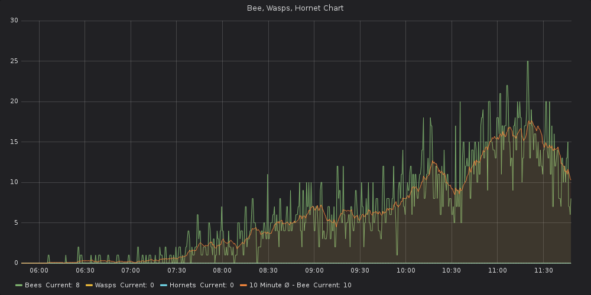
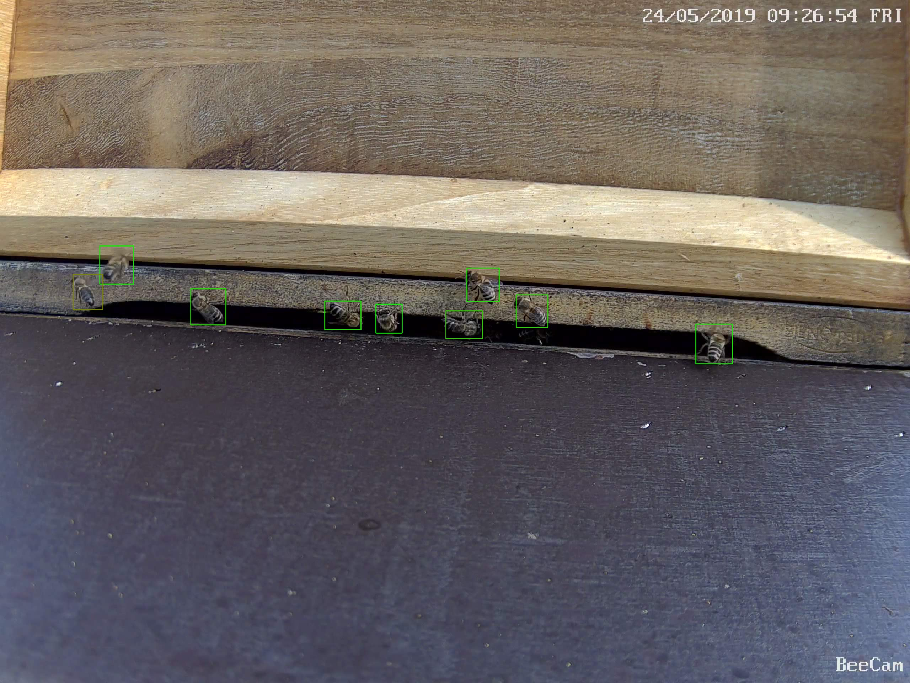

# Bee, Wasp, Hornet - Prometheus-Exporter
This Project counts bees, wasps and hornets and delivers it for the use in [Prometheus](https://prometheus.io/).
On Prometheus base charting and alarming (f.e. Swarm-alarming or Wasp-alarming) can be implemented.






# Basic-Implementation Guide


## Requirements
* a Webcam to take photos of a bee-hive entry:
  - a good resolution is strongly recommended.
  - the ability to get an picture (network, power).

* A Build-Environment that allows to `git clone https://github.com/AlexeyAB/darknet`
and to build it with `make`. Please check also with the requirements of darknet.

* Python >3.6
* some Python-libraries --> see requirements.txt


## Installation
Please run
`python setup.py`

This will clone, and build darknet-lib file and install python requirements (from txt).

## Usage
Actual there is no Daemon-Mode. One option may be to run it via linux "screen" command; .

```shell
Usage: bwh/bwh_exporter.py [OPTIONS]

Options:
  -p, --port INTEGER  Port to use  [required]
  -w, --webcam TEXT   url to webcam-JPG or picture-source to collect images
                      from  [required]
```

# Example usage
`python bwh/bwh_exporter.py -p 8004 -w https://home.jru.me/bee-cam/api.cgi\?cmd\=Snap\&channel\=0\&rs\=sdilj23SDO3DDGHJsdfs\&user\=guest\&password\=my_guest\&1555017246`

# Notes
Metrics can be accessed with browser by `<host>:<port>/metrics`. If user/password access is required - please check for Documentation of (prometheus-python-exporter)[https://github.com/prometheus/client_python] and adapt bwh-exporter.py.
